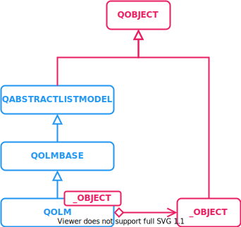

# QOlm

Bring `qolm::QOlm` data type based on `QAbstractListModel` that provide a list of `QObject` based class to **js** and **c++**. The goal of this list is to dynamically update views by reacting to **insert**, **remove**, **move** operations.

## Overview


<p align="center">
  
</p>


`QOlm` is based on `QAbstractListModel`, and behave as a list of custom `QObject`. `QOlmBase` is detail implementation to provide `signals` and `slots` that `moc` can handle. Since `moc` isn't working with template class.

### Build and execute.

- QOlm is a header only library available as a `INTERFACE` cmake target.
- It come with unit tests `QOlm_Tests`
- It come with examples `QOlm_Examples`

#### CMake super build

Add the following code snippet to your `CMakelists.txt`. This will download and build QOlm with `MyTarget`.

`CMake 3.14` is required, `CMake 3.17` is recommended to take advantage of `pch` headers.

```cmake
# ...
include(FetchContent)
FetchContent_Declare(
    QOlm
    GIT_REPOSITORY "https://github.com/OlivierLDff/QOlm"
    GIT_TAG        "master"
)
# ...
FetchContent_MakeAvailable(QOlm)
# ...

target_link_libraries(MyTarget PUBLIC QOlm)
```

#### Execute tests

If `QOLM_ENABLE_TESTS` is on then you can execute unit test.

```bash
cmake -DQOLM_ENABLE_TESTS=ON ..
cmake --build . --target QOlm_Tests --config "Release"
ctest -C "Release" .
```

To only execute certain test in as a developer:

```
./tests/QOlm_Tests --gtest_filter=TestCaseRegEx*
```

#### Execute Example

The option `QOLM_ENABLE_EXAMPLES` should be turned on.

```bash
cmake -DQOLM_ENABLE_EXAMPLES=ON ..
cmake --build . --target QOlm_Examples --config "Release"
./examples/QOlm_Examples
```

#### Additional CMake flags

Since CMake is using `FetchContent` functionality, you can add flags to understand what is going on. The library also require package Qt, so you need to indicate where Qt SDK is installed. Provide the path with `CMAKE_PREFIX_PATH`.

```bash
cmake
# Log output during download of dependencies
-DFETCHCONTENT_QUIET=OFF
# Avoid that dependencies source gets pulled at each cmake command
# Very useful when developping on dependencies too.
-DFETCHCONTENT_UPDATES_DISCONNECTED=ON
-DCMAKE_PREFIX_PATH=/Path/To/Qt
..
```

#### Dependencies

QOlm is fetching quite a few external libraries. Source of those libraries can be customize. Variables are in form `_REPOSITORY` and `_TAG`

- Qt `Core` `Qml`.
- `EVENTPP`: Provide typed callback for insert/removed/moved operation.

##### Dependencies of tests

- `GTEST` : Provide `gtest` library for unit tests.
- Qt `Tests`.

### C++ Getting started

Most of the time you want to store more than just `QObject` type, so create your custom type.

```cpp
class Foo : public QObject
{
    Q_OBJECT
public:
    Foo(QObject* parent = nullptr) : QObject(parent) {}

    int foo = 0;
};
```

Then use a `QOlm` based object with class inheritance or as a typedef.

```cpp
#include <Foo.hpp>
#include <QOlm/QOlm.hpp>

// Declare type
using FooList = qolm::QOlm<Foo>;

// Or create custom class
class FooList : public qolm::QOlm<Foo>
{
    Q_OBJECT
public:
    Foo(QObject* parent = nullptr,
        const QList<QByteArray> & exposedRoles = {},
        const QByteArray & displayRole = {}):
    qolm::QOlm<Foo>::(parent, exposedRoles, displayRole)
    {
    }
};
```

Then simply use it as a regular list.

#### Insert elements

The object provide multiple way to insert an object in the list:

* `append` : Add an object at the end of the list.
* `prepend` : Add an object at the beginning of the list.
* `insert` : Insert object at requested offset.

Those three functions can also take a `QList<_Object*>` as a parameter entry to insert multiple object at once.

```cpp
FooList list;
Foo foo1;
Foo foo2;
Foo foo3;
Foo foo4;

// {foo1}
list.append(&foo1);

// {foo2, foo1}
list.prepend(&foo2);

// {foo2, foo1, foo3}
list.append(&foo3);

// {foo2, foo4, foo1, foo3}
list.insert(1, &foo4);
```

#### Remove elements

To remove an item, simply call the `remove` function, either with a pointer to the `_Object*` , or with the index of the object at which you want to remove.

All elements can also be removed using `clear` function.

```cpp
FooList list;
Foo foo1;
Foo foo2;
Foo foo3;
Foo foo4;
list.append({&foo1, &foo2, &foo3, &foo4});

// { &foo1, &foo2, &foo4 }
list.remove(&foo3);
// { &foo1, &foo2 }
list.remove(2);
// Remove all elements.
list.clear();
```

#### Move elements

Elements can be moved within the list, without changing the list size.

* `move` from object at index `from` to index `to`.
* `moveUp`: Move object at index `index` to `index-1`. This function make sense when seeing the list in a `ListView` for example. It move the item to previous index.
* `moveDown`: Move object from `index` to `index+1`. This function make sense in a `ListView` in a column. It move the item to next index.
* `moveNext`: alias of `moveDown`.
* `movePrevious`: alias of `moveUp`.

```cpp
FooList list;
Foo foo1;
Foo foo2;
Foo foo3;
Foo foo4;
list.append({&foo1, &foo2, &foo3, &foo4});

// { &foo1, &foo3, &foo4, &foo2 }
list.move(1, 3);

// { &foo2, &foo1, &foo3, &foo4 }
list.move(3, 0);

// { &foo2, &foo3, &foo1, &foo4 }
list.movePrevious(2);

// { &foo2, &foo3, &foo4, &foo1 }
list.moveNext(2);
```

#### Access element and get index

Multiple accessors can be used to get data.

* `get` : Get pointer to the `_Object*` at `index`.
* `indexOf` : Get the `index` from a `_Object*`
* `contains` : Get if a `_Object*` is present.
* `size`: Give the number of objects in the model
* `empty` : True if model is empty.

#### Object ownership

The library follow qt ownership rules. So when inserting an object without parent, the list take ownership of that object. When the same object is removed it will be `deleteLater`.

```c++
FooList list;
// list take ownership on new Foo
list.append(new Foo());
// Since FooList have ownership on the foo at index 0, it call deleteLater on it. No need to worry about memory management.
list.remove(0);
```

#### Observe list

##### Observe as QAbstractItemModel

The `qolm::QOlm` derived object can be observe for insertion and deletion like any qt model.

* **[rowsAboutToBeInserted](https://doc.qt.io/qt-5/qabstractitemmodel.html#rowsAboutToBeInserted)**
* **[rowsAboutToBeMoved](https://doc.qt.io/qt-5/qabstractitemmodel.html#rowsAboutToBeMoved)**
* **[rowsAboutToBeRemoved](https://doc.qt.io/qt-5/qabstractitemmodel.html#rowsAboutToBeRemoved)**
* **[rowsInserted](https://doc.qt.io/qt-5/qabstractitemmodel.html#rowsInserted)**
* **[rowsMoved](https://doc.qt.io/qt-5/qabstractitemmodel.html#rowsMoved)**
* **[rowsRemoved](https://doc.qt.io/qt-5/qabstractitemmodel.html#rowsRemoved)**

But those signals are not very convenient to use as a end user. That's why `QOlm` provide other way to observe the list.

##### Observe thru signals

`qolm::QOlmBase` provide basic signal to react to `QObject` insert/remove/move operation.

* `onObjectInserted(QObject* object, int index)`
* `onObjectRemoved(QObject* object, int index)`
* `onObjectMoved(QObject* object, int from, int to)`

They are call when the model can safely be iterated. You can simply retrieve a correct pointer by using `qobject_cast<_Object*>(object)`.

##### Function override observe.

Sometime it can be useful to do some processing before the whole world gets notify about our object operation. This method is only available if you define a custom list type.

```cpp
#include <Foo.hpp>
#include <QOlm/QOlm.hpp>

class FooList : public qolm::QOlm<Foo>
{
    Q_OBJECT
public:
    FooList(QObject* parent = nullptr,
        const QList<QByteArray> & exposedRoles = {},
        const QByteArray & displayRole = {}):
    QOlm<Foo>(parent, exposedRoles, displayRole)
    {
    }

protected:
    void onItemAboutToBeInserted(_Object* item, int row) override
    {
        // Item is not yet inserted, do some preinsert operation on it.
    }
    void onItemInserted(_Object* item, int row) override
    {
        // Item just got inserted, but no callback/signal have been called yet.
    }
    void onItemAboutToBeMoved(_Object* item, int src, int dest) override
    {
        // Item haven't move yet, and no callback/signal have been called yet
    }
    void onItemMoved(_Object* item, int src, int dest) override
    {
        // Item have been moved. No Callback/Signal have been called yet.
    }
    void onItemAboutToBeRemoved(_Object* item, int row) override
    {
        // Item isn't removed yet, and no callback/signal have been called yet
    }
    void onItemRemoved(_Object* item, int row) override
    {
        // Item have been removed. Callback/Signal have been called
    }
};
```

##### Observe with callback

Regular callback not dependent on qt can be used to handle insert/remove/move operation. We can't use signal with correct pointer type because qt doesn't support template moc.

```cpp
FooList list;
list.onInserted([](const InsertedCallbackArgs& foo)
{
	// foo->foo can be directly accessed
    // foo.object gives a _Object*
    // foo.index gives inserted object index
});
list.onRemoved([](const RemovedCallbackArgs& foo)
{
	// foo->foo can be directly accessed
    // foo.object gives a _Object*
    // foo.index gives removed object index
});
list.onMoved([](const MovedCallbackArgs& foo)
{
	// foo->foo can be directly accessed
    // foo.object gives a _Object*
    // foo.from gives previous object index
    // foo.to gives new object index
});
```

Benefit of this method, is that the list can be observed by non qt object.

Each function return a callback handle that can be used to remove the callback.

```cpp
auto handleInsert = list.onInserted([](const InsertedCallbackArgs& foo) {});
list.stopListenInsert(handleInsert);
auto handleRemove = list.onInserted([](const InsertedCallbackArgs& foo) {});
list.stopListenRemove(handleRemove);
auto handleMove = list.onInserted([](const InsertedCallbackArgs& foo) {});
list.stopListenMove(handleMove);
```

#### Iterator

`QOlm` is compatible with modern iterator, you can simply do:

```cpp
FooList list;
for(const auto foo : list)
{
    //foo->getFoo()
}
```

### Getting Started Qml

The same api as the c++ work in qml. Every `Q_PROPERTY` are exposed as role, and another role `qtObject` allow to access the `QObject*`.

For the following example to work `Foo` and `FooList` need to be registered to the qml system.

```js
import QtQuick 2.0
import MyFoo 1.0

ListView {
    width: 180; height: 200
    FooList { id: _fooList }

    model: _fooList
    delegate: Text
    {
        // Access role qtObject and cast it to our type
        property Foo fooObj : model.qtObject
        text: index + ": " +
            fooObj.foo + // Access via casted object
            + ", " +
            foo // Access via role
    }

    Component.onCompleted:
    {
        _fooList.append(new Foo())
        _fooList.insert(1, new Foo())
        _fooList.prepend(new Foo())
    }
}
```

If you need to filter exposed roles, then use the constructor arguments. Same to set a display role.

```cpp
//QOlm(QObject* parent = nullptr,
//   const QList<QByteArray> & exposedRoles = {},
//   const QByteArray & displayRole = {})

// The following code expose foo as exposedRoles, and foo as Qt::DisplayRole
FooList list(nullptr, {"foo"}, "foo");
```

It is recommended to only expose role that are required for `QSortFilterProxyModel ` subclass. And use native signal to property for property that often change.

## Todo

- [ ] Turn examples into unit tests
- [ ] Qml Example


## Authors

* [Olivier LDff](https://github.com/OlivierLDff)